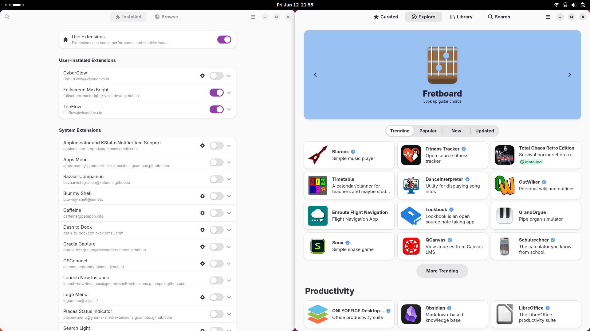

https://github.com/user-attachments/assets/86a09b8e-3932-42ec-bf79-dce9f882df07

#  TileFlow

<table>
  <tr>
    <td>
      <strong>A GNOME Shell extension that tiles your windows automatically.</strong><br>
      One window fills the screen, two split 50/50 left and right,<br>
      and a third moves to its own workspace.<br>
      Works across workspaces—open, close, and move windows without touching a layout shortcut.
    </td>
    <td>
      
    </td>
  </tr>
</table>

## Features

- **Automatic Tiling**: Arranges windows as soon as they open or close
- **Smart Layout**: Maximizes a single window; splits two side by side
- **Workspace Overflow**: Sends a third window to a new workspace automatically
- **Manual Moves Respected**: Dragging a window to another workspace keeps the correct left/right placement
- **No Configuration Needed**: Works out of the box

### Tiled & Excluded Windows

- **Tiled**: Browsers, terminals, editors, file managers, and most normal application windows
- **Excluded**: Video players (VLC, MPV, Celluloid, Totem, SMPlayer, Kodi, Plex, Jellyfin), dialogs and popups, fullscreen windows

## Installation

### From GNOME Extensions (Recommended)

Once published, install directly from [extensions.gnome.org](https://extensions.gnome.org/).

### Manual Installation

Clone or download this repository, then:

```bash
cp -r TileFlow@visnudeva.github.io ~/.local/share/gnome-shell/extensions/

gnome-extensions enable TileFlow@visnudeva.github.io
```

Restart GNOME Shell after installation (Wayland: log out and back in; X11: Alt+F2, type `r`).

## How It Works

1. Watches for window open, close, workspace, and maximize changes
2. Maximizes the window when only one is on a workspace
3. Splits two windows into a 50/50 left-right layout
4. Moves a third window to a new workspace (or pairs it with a lone window on the next one)

## Configuration

The extension works out of the box with no configuration needed.

## Development

Run the unit tests:

```bash
node --test test/*.test.js
```

## Troubleshooting

**Extension not working?**
- Ensure the extension is enabled: `gnome-extensions list --enabled`
- Check logs: `journalctl -f -o cat | grep -i tileflow`
- Restart GNOME Shell after installation

**A window is not tiling?**
- Video players and media apps are intentionally left alone
- Dialogs and transient windows stay with their parent window
- Manually maximizing one window in a pair keeps it expanded until you unmaximize

## Requirements

- GNOME Shell 48–50

## License

GNU General Public License v2.0 or later. See the [LICENSE](LICENSE) file for details.

## Contributing

Issues and pull requests welcome at [GitHub](https://github.com/visnudeva/TileFlow).
